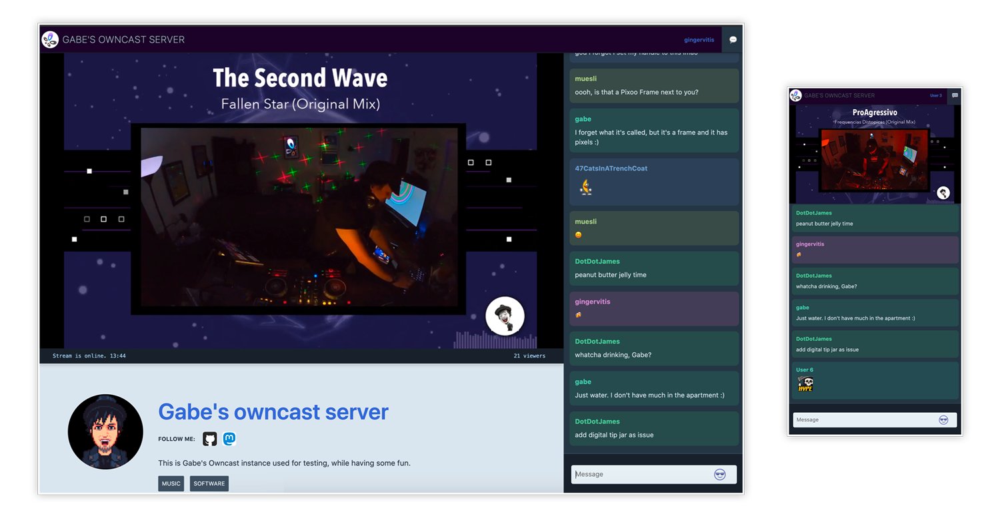

<!--
N.B.: Questo README è stato automaticamente generato da <https://github.com/YunoHost/apps/tree/master/tools/readme_generator>
NON DEVE essere modificato manualmente.
-->

# Owncast per YunoHost

[](https://dash.yunohost.org/appci/app/owncast)  

[](https://install-app.yunohost.org/?app=owncast)

*[Leggi questo README in altre lingue.](./ALL_README.md)*

> *Questo pacchetto ti permette di installare Owncast su un server YunoHost in modo semplice e veloce.*  
> *Se non hai YunoHost, consulta [la guida](https://yunohost.org/install) per imparare a installarlo.*

## Panoramica

Owncast is an open source, self-hosted, decentralized, single user live streaming and chat server for running your own live streams similar in style to the large mainstream options. It offers complete ownership over your content, interface, moderation and audience.

**Versione pubblicata:** 0.1.2~ynh1

**Prova:** <https://watch.owncast.online/>

## Screenshot



## Documentazione e risorse

- Sito web ufficiale dell’app: <https://owncast.online/>
- Documentazione ufficiale per gli amministratori: <https://owncast.online/docs/>
- Repository upstream del codice dell’app: <https://github.com/owncast/owncast>
- Store di YunoHost: <https://apps.yunohost.org/app/owncast>
- Segnala un problema: <https://github.com/YunoHost-Apps/owncast_ynh/issues>

## Informazioni per sviluppatori

Si prega di inviare la tua pull request alla [branch di `testing`](https://github.com/YunoHost-Apps/owncast_ynh/tree/testing).

Per provare la branch di `testing`, si prega di procedere in questo modo:

```bash
sudo yunohost app install https://github.com/YunoHost-Apps/owncast_ynh/tree/testing --debug
o
sudo yunohost app upgrade owncast -u https://github.com/YunoHost-Apps/owncast_ynh/tree/testing --debug
```

**Maggiori informazioni riguardo il pacchetto di quest’app:** <https://yunohost.org/packaging_apps>
