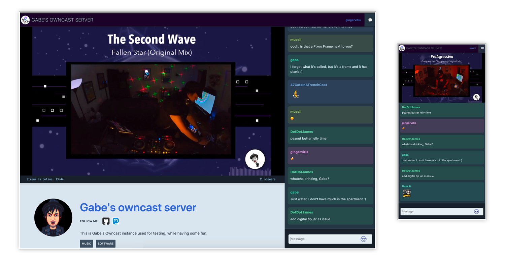

<!--
Важно: этот README был автоматически сгенерирован <https://github.com/YunoHost/apps/tree/master/tools/readme_generator>
Он НЕ ДОЛЖЕН редактироваться вручную.
-->

# Owncast для YunoHost

[](https://ci-apps.yunohost.org/ci/apps/owncast/)


[](https://install-app.yunohost.org/?app=owncast)

*[Прочтите этот README на других языках.](./ALL_README.md)*

> *Этот пакет позволяет Вам установить Owncast быстро и просто на YunoHost-сервер.*  
> *Если у Вас нет YunoHost, пожалуйста, посмотрите [инструкцию](https://yunohost.org/install), чтобы узнать, как установить его.*

## Обзор

Owncast is an open source, self-hosted, decentralized, single user live streaming and chat server for running your own live streams similar in style to the large mainstream options. It offers complete ownership over your content, interface, moderation and audience.

**Поставляемая версия:** 0.2.1~ynh1

**Демо-версия:** <https://watch.owncast.online/>

## Снимки экрана



## Документация и ресурсы

- Официальный веб-сайт приложения: <https://owncast.online/>
- Официальная документация администратора: <https://owncast.online/docs/>
- Репозиторий кода главной ветки приложения: <https://github.com/owncast/owncast>
- Магазин YunoHost: <https://apps.yunohost.org/app/owncast>
- Сообщите об ошибке: <https://github.com/YunoHost-Apps/owncast_ynh/issues>

## Информация для разработчиков

Пришлите Ваш запрос на слияние в [ветку `testing`](https://github.com/YunoHost-Apps/owncast_ynh/tree/testing).

Чтобы попробовать ветку `testing`, пожалуйста, сделайте что-то вроде этого:

```bash
sudo yunohost app install https://github.com/YunoHost-Apps/owncast_ynh/tree/testing --debug
или
sudo yunohost app upgrade owncast -u https://github.com/YunoHost-Apps/owncast_ynh/tree/testing --debug
```

**Больше информации о пакетировании приложений:** <https://yunohost.org/packaging_apps>
